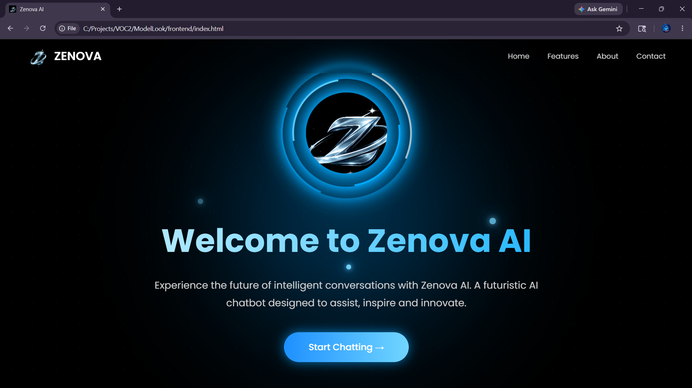
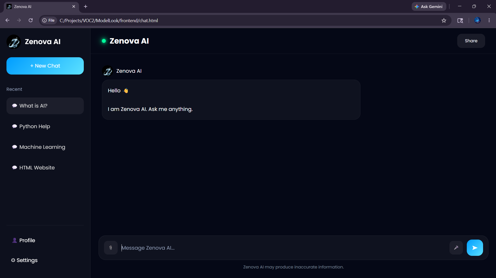
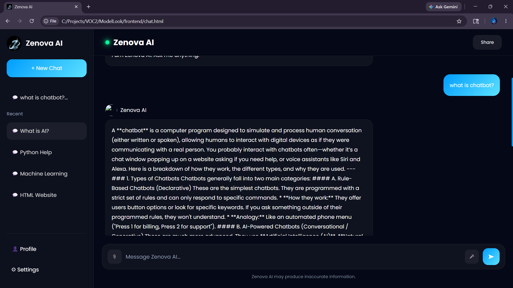

# ✨ Zenova AI Chatbot

A futuristic AI chatbot web application built using:

- HTML5
- CSS3
- JavaScript
- Flask (Python Backend)
- Google Gemini AI API

---

# 🚀 Features

✅ Modern futuristic UI  
✅ Animated moving navbar  
✅ AI-powered chatbot responses  
✅ Chat history system  
✅ New chat support  
✅ Profile & settings panels  
✅ Login & signup UI  
✅ Responsive design  
✅ Neon glowing effects  
✅ Gemini AI integration  

---

# 📸 Screenshots

## Home Screen



---

## Chat Screen 1



---

## Chat Screen 2



---

# 📂 Project Structure

```bash
MODELLOOK/
│
├── backend/
│   ├── app.py
│   ├── requirements.txt
│
├── frontend/
│   ├── chat.css
│   ├── chat.html
│   ├── chat.js
│   ├── index.html
│   ├── logo.jpeg
│   ├── script.js
│   └── style.css
│
├── images/
│   ├── Chat_Screen1.png
│   ├── Chat_Screen2.png
│   └── Home_Screen.png
│
└── README.md
```

---

# ⚙ Installation

## 1️⃣ Clone Repository

```bash
git clone https://github.com/Ai-Sridhar/Zenova-Web.git
```

---

## 2️⃣ Open Project

```bash
cd MODELLOOK
```

---

## 3️⃣ Install Requirements

```bash
pip install flask flask-cors google-generativeai
```

---

## 4️⃣ Run Backend

```bash
python app.py
```

---

## 5️⃣ Open Frontend

Open:

```bash
frontend/index.html
```

using Live Server.

---

# 🔑 Gemini API Setup

Inside `app.py`

Replace:

```python
API_KEY = "YOUR_API_KEY"
```

with your Gemini API key.

---

# 🧠 Backend Example

```python
response = model.generate_content(user_message)
```

---

# 🌌 UI Design

Zenova AI uses:

- Glassmorphism UI
- Neon glowing animations
- Futuristic AI styling
- Animated moving navbar
- Responsive chatbot layout

---

# 👨‍💻 Team Zenova

## Team Name

✨ **Zenova**

---

## Team Members

- Roshini
- Varshana
- Rishiya
- Sanjay
- Shakthi
- Sridhar

---

# 📜 License

This project is open-source and free to use.